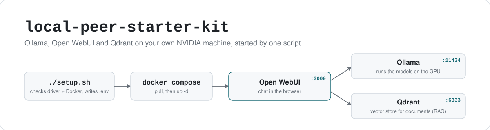

<p align="center">
  <picture>
    <source media="(prefers-color-scheme: dark)" srcset="assets/hero-dark.svg">
    
  </picture>
</p>

<p align="center">
  
  
  
  <a href="LICENSE"></a>
</p>

# local-peer-starter-kit

A Docker Compose file and a setup script that start a private chat stack on one Linux machine with an
NVIDIA GPU: [Ollama](https://github.com/ollama/ollama) runs the models,
[Open WebUI](https://github.com/open-webui/open-webui) is the chat page in your browser, and
[Qdrant](https://github.com/qdrant/qdrant) stores the document embeddings Open WebUI uses for RAG. Your chats,
documents and models stay in folders next to the compose file. The goal is one command from "Docker works"
to "chatting with a local model", without writing the compose file by hand.

## The stack

| Service | Image | Container | Port (host) | Data folder |
|---|---|---|---|---|
| Ollama (inference) | `ollama/ollama:latest` | `local-peer-ollama` | `11434` | `./ollama_data` |
| Open WebUI (chat, RAG) | `ghcr.io/open-webui/open-webui:main` | `local-peer-webui` | `3000` | `./webui_data` |
| Qdrant (vector store) | `qdrant/qdrant:latest` | `local-peer-qdrant` | `6333` (HTTP), `6334` (gRPC) | `./qdrant_storage` |

Open WebUI is pointed at Ollama (`OLLAMA_BASE_URL=http://ollama:11434`) and told to use Qdrant instead of its
built-in ChromaDB (`VECTOR_DB=qdrant`, `QDRANT_URI=http://qdrant:6333`). Ollama gets every NVIDIA GPU on the
machine through a Compose device reservation. All three containers use `restart: always`, so they come back
after a reboot until you run `docker compose down`.

## Requirements

What `setup.sh` checks, and stops on if missing:

- `nvidia-smi` on the PATH (the NVIDIA driver)
- `docker` and Docker Compose v2 (`docker compose version`)

What it doesn't check but still needs:

- the [NVIDIA Container Toolkit](https://docs.nvidia.com/datacenter/cloud-native/container-toolkit/latest/install-guide.html),
  so Docker can hand the GPU to the Ollama container
- internet access while setting up: the images come from Docker Hub and GHCR, and models come from Ollama's library
- disk space for the images plus whatever models you pull

Rough sizing, not a hard rule: a 7B or 8B model at 4-bit needs about 8 GB of VRAM and around 5 GB of disk.
Bigger models need more of both. 16 GB of system RAM or more keeps Open WebUI and Qdrant comfortable next to it.

## Quick start

```bash
git clone https://github.com/CocaKova/local-peer-starter-kit.git
cd local-peer-starter-kit
./setup.sh
```

`setup.sh` runs four steps:

1. checks for `nvidia-smi`
2. checks for `docker` and `docker compose`
3. if there is no `.env` yet, copies `.env.example` to `.env` and replaces `WEBUI_SECRET_KEY` with a random one
   (`openssl rand -hex 32`, or `/dev/urandom` if openssl is missing). An existing `.env` is left alone.
4. `docker compose pull`, then `docker compose up -d`

Then open <http://localhost:3000>. The first account you create in Open WebUI becomes its admin.

You need at least one model before you can chat. Pull one from Open WebUI's model settings, or from the
command line:

```bash
docker exec local-peer-ollama ollama pull llama3.2
```

The first pull takes a while, depending on your connection and the model's size. Models are stored in
`./ollama_data`, so you download each one once.

| Service | URL |
|---|---|
| Open WebUI (chat) | <http://localhost:3000> |
| Ollama API | <http://localhost:11434> |
| Qdrant dashboard | <http://localhost:6333/dashboard> |

## Configuration

Everything is in `.env`, created from [`.env.example`](.env.example) on the first run:

| Variable | Default | What it does |
|---|---|---|
| `OLLAMA_PORT` | `11434` | host port for the Ollama API |
| `WEBUI_PORT` | `3000` | host port for Open WebUI |
| `WEBUI_SECRET_KEY` | random, written by `setup.sh` | Open WebUI's session secret |
| `QDRANT_PORT` | `6333` | host port for Qdrant's HTTP API |
| `QDRANT_STORAGE_PATH` | `./qdrant_storage` | where Qdrant keeps its data |

After editing `.env`, run `docker compose up -d` again. Two things to know:

- `OLLAMA_HOST=0.0.0.0` is in `.env.example`, but the compose file doesn't pass it to any container, so changing
  it does nothing.
- `setup.sh` prints the default URLs (3000, 11434, 6333) at the end even if you changed the ports.

## Day to day

```bash
docker compose ps                                # what's running
docker compose logs -f open-webui                # follow a service's logs
docker compose pull && docker compose up -d      # update to the newest images
docker compose down                              # stop everything; data folders stay
```

To remove everything, run `docker compose down` and then delete `ollama_data/`, `webui_data/`,
`qdrant_storage/` and `.env`.

## Limits and security

- **NVIDIA on Linux only.** `setup.sh` exits if `nvidia-smi` isn't found, and the compose file reserves NVIDIA
  devices. Nothing else has been tested.
  - AMD: Ollama publishes a ROCm image (`ollama/ollama:rocm`). Swapping it in means changing the image, removing
    the NVIDIA device reservation and passing `/dev/kfd` and `/dev/dri` through, and skipping the `nvidia-smi`
    check. This kit doesn't do that for you.
  - macOS: Docker on a Mac can't use the GPU. Run Ollama natively and point Open WebUI's `OLLAMA_BASE_URL` at it
    instead. Also untested here.
- **The ports listen on every network interface.** The compose file publishes them without a host address, so
  other machines on your network can reach them. The Ollama API and Qdrant have no authentication in this
  setup. If the machine isn't on a network you trust, change the port lines to `"127.0.0.1:${OLLAMA_PORT}:11434"`
  and so on, or firewall them.
- **Images aren't pinned.** `latest` and `main` move. An update can change behavior or break the setup; pin a
  version tag in `docker-compose.yml` if you need it to stay put.
- **Private once it's running, but not offline to set up.** This kit adds no telemetry of its own. Ollama,
  Open WebUI and Qdrant have their own defaults; check their docs if that matters to you.

This is a personal starter kit, not an official distribution. It is not affiliated with or endorsed by
Ollama, Open WebUI, Qdrant or NVIDIA.

## License

MIT, see [LICENSE](LICENSE). The images it pulls are under their own projects' licenses.
